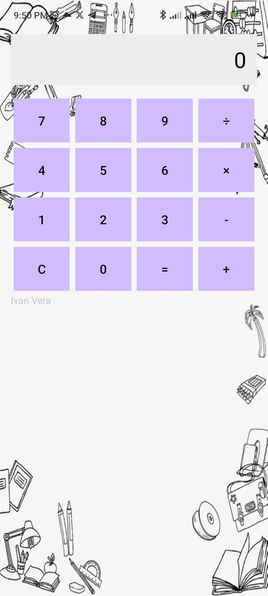

# Calculadora Básica

Esta es una aplicación de calculadora básica desarrollada en Android utilizando Kotlin. La calculadora permite realizar operaciones matemáticas simples como suma, resta, multiplicación y división.

## Características
- **Operaciones soportadas**: suma, resta, multiplicación y división.
- **Interfaz intuitiva**: botones numéricos y de operaciones claramente organizados.
- **Cálculo en cadena**: permite realizar operaciones consecutivas sin necesidad de presionar el botón de igual cada vez.
- **Manejo de errores**: muestra "Error" al intentar dividir entre cero.

## Capturas de pantalla
</img>

## Configuración del Entorno
1. **Requisitos previos**:
   - Android Studio instalado.
   - Emulador de Android o un dispositivo físico para pruebas.
2. **Instrucciones**:
   - Clona este repositorio:
     ```bash
     git clone https://github.com/IvanVY/Calculadora-Basica.git
     ```
   - Abre el proyecto en Android Studio.
   - Ejecuta la aplicación en un emulador o dispositivo conectado.

## Uso
1. Inicia la aplicación.
2. Ingresa números y selecciona una operación.
3. Presiona el botón de igual (`=`) para ver el resultado.
4. Usa el botón "C" para limpiar la pantalla y reiniciar la operación.

---
© 2025 Ivan Vera

